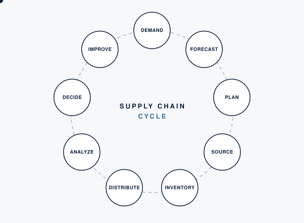

   

## About

Supply Chain Analyst with 3 years of experience supporting demand and supply planning, procurement, inventory optimization, logistics, and distribution across manufacturing and consumer goods environments. I work in SAP S/4HANA, SAP IBP, SQL, Power BI, Tableau, Excel, and Python for forecasting, KPI reporting, and process improvement, and I turn operational data into practical planning decisions.

## Supply chain flow

## Data flow

## Professional Experience

  

