   

## Supply chain flow

## Data flow

## 1. Forecast accuracy, WAPE and bias

## 2. Safety stock and reorder point

## 3. Inventory turns and days on hand

## 4. Fill rate, OTIF and order cycle time

## 5. S&OP: the monthly planning cycle

(keep the formulas and bullet points below the image)

## Professional Experience

  

